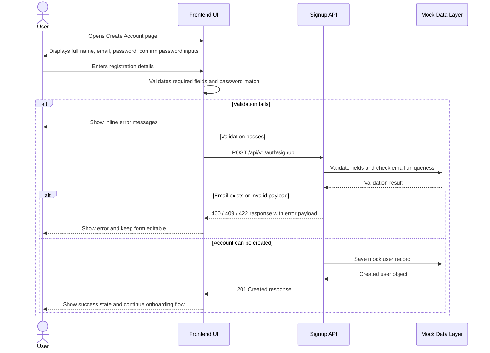
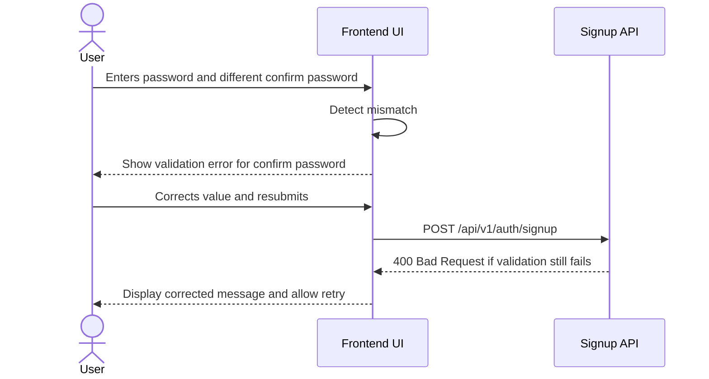
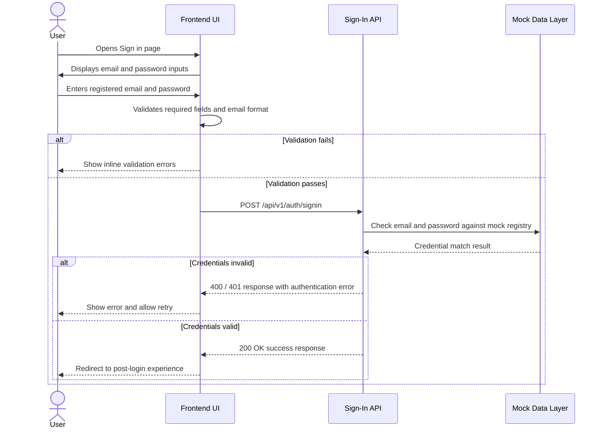
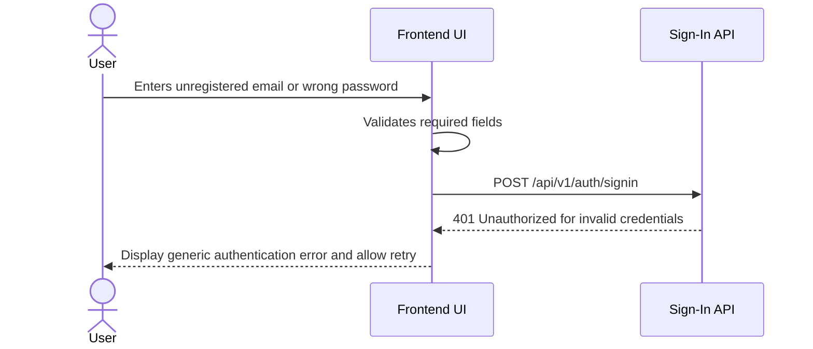

# API Journey Diagram

## Signup Workflow

## Error Scenario: Password mismatch

## Sign-In Workflow

## Error Scenario: Invalid credentials

## Business Flow Summary
1. User opens the signup page.
2. User fills in the required form fields.
3. Frontend validates required fields and confirm-password match.
4. If valid, request is sent to the signup API.
5. Backend/mock validation checks required fields, email format, and uniqueness.
6. If accepted, a mock user record is created and success response is returned.
7. If rejected, the user sees error messaging and can retry.
8. User opens the sign-in page and submits registered email and password.
9. Frontend validates required fields.
10. Backend/mock validation checks email and password against the mock registry.
11. If correct, the user is redirected into the authenticated experience.
12. If incorrect, the user receives a clear auth error and retries.

## Data Source Note
This flow uses a mock data layer and does not include a database-backed persistence workflow for either the signup or sign-in feature.
